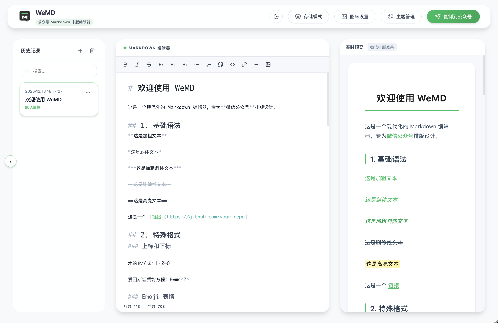

<p align="center">
  
</p>

<h1 align="center">WeMD</h1>

<p align="center">
  <strong>更优雅的 Markdown 公众号排版工具</strong>
</p>

<p align="center">
  告别复杂工具。Markdown 写作，一键复制到公众号。<br>
  专为公众号创作者设计的<b>本地优先</b>编辑器。
</p>

<p align="center">
  <a href="https://wemd.app">🌐 官网</a> •
  <a href="https://edit.wemd.app">✏️ 在线使用</a> •
  <a href="https://wemd.app/docs">📖 文档</a> •
  <a href="https://github.com/tenngoxars/WeMD/releases">📦 下载桌面版</a>
</p>

<p align="center">
  <a href="LICENSE"></a>
  
  
  
  
</p>

---

## ✨ 特性

|     | 功能              | 说明                                                   |
| --- | ----------------- | ------------------------------------------------------ |
| 📝  | **Markdown 语法** | 支持 GFM、表格、代码高亮、数学公式                     |
| 🎨  | **主题切换**      | 内置十余款精美主题，支持可视化设计器或自定义 CSS       |
| 📋  | **一键复制**      | 完美兼容微信公众号，所见即所得                         |
| 🖼️  | **多图床支持**    | 官方图床 / 七牛云 / 阿里云 / 腾讯云 / S3 兼容          |
| 💾  | **本地优先**      | 数据存储在本地，无需登录，隐私安全                     |
| 📱  | **跨平台**        | Web 端 + 桌面端（macOS / Windows / Linux）             |
| 🌙  | **界面风格**      | 亮色 / 深色 双模式可选                                 |
| 👁️  | **深色模式预览**  | 预览微信深色模式效果，还原度达 98%+                    |
| 🔍  | **高级搜索**      | 支持正则匹配、全词匹配、批量替换                       |
| 🎞️  | **滑动图组**      | 支持水平滑动的多图展示组件，丰富视觉体验               |
| 📊  | **Mermaid 图表**  | 内置流程图、时序图、甘特图等多种图表，自动适配主题配色 |

---

## 💡 技术亮点

### 微信深色模式预览算法

WeMD 内置了一套**色彩语义保全算法**，可在编辑器中预览微信公众号深色模式下的实际效果，还原度达 **98% 以上**。

> 该算法基于微信官方开源的 [wechatjs/mp-darkmode](https://github.com/wechatjs/mp-darkmode) 核心算法迁移并优化，旨在保证高性能 CSS 转换的同时提供最接近官方的渲染效果。

- 智能识别不同元素类型，分别优化
- HSL 色彩空间计算，确保视觉一致性

这（可能）是目前市面上除官方外唯一针对微信公众号深色模式预览的开源解决方案。

👉 **[查看算法详细原理解析](https://wemd.app/docs/reference/dark-mode-algorithm.html)** | **[查看算法源码](packages/core/src/wechatDarkMode.ts)**

---

## 🚀 快速开始

### 在线使用

直接访问 **[edit.wemd.app](https://edit.wemd.app)** 即可开始写作，无需安装，同样支持纯本地存储。

### 桌面版下载

前往 [Releases](https://github.com/tenngoxars/WeMD/releases) 下载对应平台安装包：

- **macOS**: `.dmg`（Intel 版）/ `-arm64.dmg`（Apple Silicon 版）
- **Windows**: `.exe`
- **Linux**: `.AppImage`

> ⚠️ **macOS 用户注意**：首次打开时如提示"应用已损坏"，请在终端执行：
>
> ```bash
> xattr -cr /Applications/WeMD.app
> ```
>
> ⚠️ **Windows 用户注意**：如 SmartScreen 提示"未知发布者"，点击「更多信息」→「仍要运行」
>
> ⚠️ **Linux 用户注意**：运行前需设置可执行权限：`chmod +x WeMD.AppImage`

### Docker 部署

```bash
docker compose pull
docker compose up -d
```

访问 `http://localhost:8080` 即可使用。

默认会拉取 `ghcr.io/tenngoxars/wemd-web:latest`。  
如需指定版本镜像，可覆盖环境变量：

```bash
WEMD_IMAGE=ghcr.io/tenngoxars/wemd-web:<版本号> docker compose up -d
```

---

## 🛠️ 本地开发

### 环境要求

- Node.js ≥ 18
- pnpm ≥ 9（推荐 `corepack enable pnpm`）

### 安装与运行

```bash
# 安装依赖
pnpm install

# 启动 Web 开发服务器
pnpm dev:web

# 启动桌面端（需先启动 Web）
pnpm dev:desktop
```

### 构建

```bash
# 构建 Web
pnpm --filter @wemd/web build

# 构建桌面应用
pnpm --filter wemd-electron run build:mac  # macOS
pnpm --filter wemd-electron run build:win  # Windows
```

---

## 📁 项目结构

```
WeMD/
├── apps/
│   ├── web/        # React + Vite 前端
│   ├── electron/   # Electron 桌面端
│   └── server/     # NestJS 图片上传服务
├── packages/
│   └── core/       # Markdown 解析 / 主题 / 工具
├── templates/      # 主题 CSS 模板
└── turbo.json      # Turborepo 配置
```

---

## 📸 截图



---

## 💬 反馈

如有问题或建议，欢迎提交 [Issue](https://github.com/tenngoxars/WeMD/issues)。

---

## 🤝 致谢

本项目的微信深色模式预览算法深度参考了微信官方开源的 [wechatjs/mp-darkmode](https://github.com/wechatjs/mp-darkmode) 核心逻辑。感谢微信团队为开发者提供的优秀解决方案！

---

## 📄 License

[MIT](LICENSE) © WeMD Team
